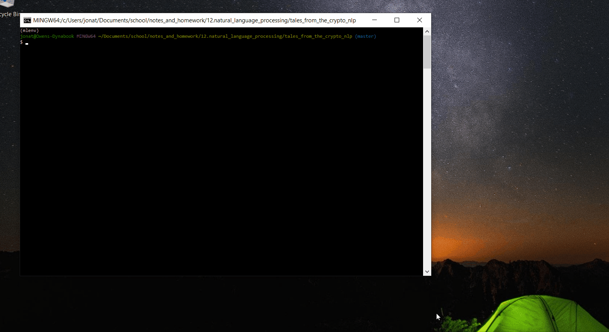

# Tales From The Crypto
This project is to test my understanding of natural language processing focused on news sentiment taught in the Rice University FinTech Bootcamp.[1]

---

## Table of contents
* [General Information](#general-information)
* [Screenshots](#screenshots)
* [Technologies](#technologies)
* [Installation Guide](#installation-guide)
* [Code Examples](#code-examples)
* [Usage](#usage)
* [Sources](#sources)
* [Status](#status)
* [Contributors](#contributors)

---

## General Information

There's been a lot of hype in the news lately about cryptocurrency, so we want to take stock, so to speak, of the latest news headlines regarding Bitcoin and Ethereum to get a better feel for the current public sentiment around each coin.  The following project allows us to gain a hands-on approach to natural language processing and sentiment in the news focused on Bitcoin and Ethereum, while understanding other factors involved with the coin prices such as common words, phrases, organizations, and entities mentioned in news articles.[1]

---

## Screenshots

* Sentiment polarity scores for five Ethereum articles


* Named entity recognition analysis for Bitcoin articles


---

## Technologies

* See [requirements.txt](requirements.txt) for a list of libraries to create a machine learning environment.

---

## Installation Guide

1. Download the entire repository
2. Open Git Terminal
3. Navigate into the repository file path where you stored the files during the download.
4. The notebook files should be visible to run.
5. Make sure to create a separate virtual environment for the natural language processing libraries (nlpenv).
6. Use [requirements.txt](requirements.txt) in the repository to install the libraries using the following commands:[2]

    - conda deactivate
    - conda create -n nlpenv python=3.7.7
    - conda activate nlpenv
    - pip install -r requirements.txt
    - If the previous command has errors try:
        - conda install -r requirements.txt

*See the [Usage](#usage) section below for instructions to run the notebook.

---

## Code Examples

* Tockenizing and cleaning data

```python
def tokenizer(text):
    """Tokenizes text"""
    # Create a list of the words
    words_tokened = word_tokenize(text)

    # Convert the words to lowercase
    words_lowered = [word.lower() for word in words_tokened]

    # Remove the punctuation
    regex = re.compile('[^a-zA-Z]')
    words_regexed = [regex.sub('', word) for word in words_lowered]
    
    # Remove the stop words
    sw = set(stopwords.words('english'))
    stopwords_removed = [word.lower() for word in words_regexed if word not in sw.union(sw_add_ons)]

    # Lemmatize Words into root words
    lemmatizer = WordNetLemmatizer()
    tokens = [lemmatizer.lemmatize(word) for word in stopwords_removed]

    return tokens
```

* Creating a string of Bitcoin text to generate a word cloud
```python
# Generate the Bitcoin word cloud
bitcoin_words_joined = ' '.join(bitcoin_words_tokened)
wc = WordCloud().generate(bitcoin_words_joined)
plt.imshow(wc)
plt.title('Bitcoin Word Cloud',
    fontdict={'size': 35},
    loc='Center'
)
plt.axis('off')
```


---

## Usage

1. To run the analysis process, navigate to crypto_sentiment.ipynb using Git Terminal within the directory tales_from_the_crypto_nlp.

2. Execute the command 'code .' in the terminal to open VS Code.

3. VS Code opens.  Select the crypto_sentiment.ipynb file found in the left side navigation pane.

4. Click the Run All Cells button, double arrows, found at the top of the main workspace to run all cells in the Jupyter Notebook file.

5. All cells in the notbook run.


---

## Sources

- [1] https://rice.bootcampcontent.com/Rice-Coding-Bootcamp/rice-hou-fin-pt-09-2020-u-c/tree/master/hw/12-NLP/Instructions

- [2] https://blog.usejournal.com/why-and-how-to-make-a-requirements-txt-f329c685181e

---

## Status

Project is: _complete_

---

## Contributors

* Jonathan Owens
* LinkedIn: www.linkedin.com/in/jonowens
